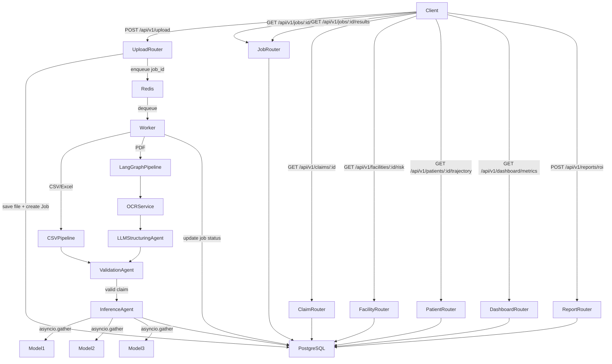

# Design Document — ResultShield Lite (RSL) API Endpoints

## Overview

ResultShield Lite is a fraud detection REST API for Kenyan insurance companies processing CBC/FBC medical claims. The system accepts claim data via CSV, Excel, PDF, or image upload, runs a multi-model ML inference pipeline, persists results to PostgreSQL, and exposes eight endpoint groups for querying jobs, claims, facility risk, patient trajectories, dashboard metrics, and ROI reports.

The existing OCR service (`app/services/ocr_service.py`) is a working PaddleOCR singleton and must not be modified. PDF and image claims flow through a four-node LangGraph pipeline (OCR → LLM structuring → validation → inference). CSV/Excel claims bypass OCR and go directly to validation and inference.

Three Keras models are available at startup:
- **Model 1** — Per-claim autoencoder (anomaly detection via reconstruction error)
- **Model 2** — Hierarchical disease classifier (category + diagnosis prediction)
- **Model 3** — Patient temporal LSTM autoencoder (trajectory anomaly detection)
- **Model 4** — Facility temporal model (files absent; gracefully skipped)

All endpoints are mounted under `/api/v1/`. The existing `/ocr/test` endpoint is preserved without modification.

---

## Architecture



### Key Design Decisions

- **Background workers over Celery**: The job queue uses Redis directly with `asyncio` background tasks (via `asyncio.create_task` at upload time) rather than Celery, keeping the stack simpler and avoiding a separate worker process. A `workers/` module encapsulates the processing logic.
- **ModelRegistry singleton**: All Keras models, scalers, and encoders are loaded once at startup via a `@lru_cache`-decorated factory, mirroring the existing `get_ocr_service()` pattern.
- **SQLModel for ORM**: SQLModel unifies Pydantic validation and SQLAlchemy table definitions, consistent with the existing dependency stack.
- **LangGraph for PDF pipeline**: The four-node graph provides explicit state transitions and conditional error routing without requiring a custom state machine.

---

## Components and Interfaces

### Directory Layout

```
app/
  core/
    config.py          # extended Settings (PSQL_URI, REDIS_URL, OPENAI_API_KEY, MODELS_DIR, MAX_BATCH_SIZE)
  db/
    __init__.py
    session.py         # async engine + get_async_session()
  models/              # SQLModel ORM table definitions
    __init__.py
    job.py
    claim.py
    fraud_flag.py
    patient_trajectory.py
    facility_metric.py
  schemas/
    ocr.py             # existing — DO NOT MODIFY
    upload.py
    job.py
    claim.py
    facility.py
    patient.py
    dashboard.py
    report.py
  services/
    ocr_service.py     # existing — DO NOT MODIFY
    model_registry.py  # ModelRegistry singleton
    inference_service.py
    job_service.py
    csv_pipeline.py
  agent/
    __init__.py
    config.py          # existing (empty — will add LangGraph graph)
    graph.py           # LangGraph graph definition
    nodes.py           # ocr_node, llm_structuring_node, validation_node, inference_node
    state.py           # PipelineState TypedDict
  routes/
    __init__.py
    upload.py
    jobs.py
    claims.py
    facilities.py
    patients.py
    dashboard.py
    reports.py
  workers/
    __init__.py
    job_worker.py      # background task entry point
  utils/
    file_handler.py    # existing — DO NOT MODIFY
    pdf_handler.py     # existing — DO NOT MODIFY
  main.py              # existing — add startup hooks + include routers
```

### Route → Service Mapping

| Endpoint | Router | Service |
|---|---|---|
| POST /api/v1/upload | routes/upload.py | job_service, csv_pipeline / agent/graph (OCR pipeline for PDF + images) |
| GET /api/v1/jobs/{id}/status | routes/jobs.py | job_service |
| GET /api/v1/jobs/{id}/results | routes/jobs.py | job_service |
| GET /api/v1/claims/{id} | routes/claims.py | DB query |
| GET /api/v1/facilities/{id}/risk | routes/facilities.py | DB query + FacilityWeeklyMetric |
| GET /api/v1/patients/{id}/trajectory | routes/patients.py | DB query + PatientTrajectory |
| GET /api/v1/dashboard/metrics | routes/dashboard.py | DB aggregation |
| POST /api/v1/reports/roi | routes/reports.py | arithmetic + optional PDF |

---

## Data Models

### SQLModel ORM Tables

#### `Job`
```python
class Job(SQLModel, table=True):
    id: Optional[int] = Field(default=None, primary_key=True)
    job_id: str = Field(unique=True, index=True)          # UUID string
    filename: str
    file_type: str                                         # "csv" | "xlsx" | "pdf"
    status: str = Field(default="pending")                 # pending|processing|completed|failed|partial
    total_claims: int = Field(default=0)
    processed_claims: int = Field(default=0)
    failed_claims: int = Field(default=0)
    error_detail: Optional[str] = None
    created_at: datetime = Field(default_factory=datetime.utcnow)
    updated_at: datetime = Field(default_factory=datetime.utcnow)
```

#### `Claim`
```python
class Claim(SQLModel, table=True):
    id: Optional[int] = Field(default=None, primary_key=True)
    claim_id: str = Field(unique=True, index=True)
    job_id: str = Field(index=True)                        # FK to Job.job_id
    patient_id: str = Field(index=True)
    facility_id: str = Field(index=True)
    admission_date: date
    discharge_date: date
    claimed_diagnosis: str
    created_at: datetime = Field(default_factory=datetime.utcnow)
```

#### `CBCData`
```python
class CBCData(SQLModel, table=True):
    id: Optional[int] = Field(default=None, primary_key=True)
    claim_id: int = Field(foreign_key="claim.id", index=True)
    age: float
    sex_encoded: int                                       # 0=Female, 1=Male
    HGB: float
    HCT: float
    MCV: float
    MCHC: float
    NEU: float
    LYM: float
    EOS: float
    BAS: float
    MON: float
    PLT: float
    length_of_stay: float
```

#### `FraudFlag`
```python
class FraudFlag(SQLModel, table=True):
    id: Optional[int] = Field(default=None, primary_key=True)
    claim_id: int = Field(foreign_key="claim.id", index=True)
    model_id: int                                          # 1, 2, 3, or 4
    anomaly_score: float                                   # 0.0–1.0
    is_anomaly: bool
    severity: str                                          # low | medium | high
    flag_reason: str
    # Model 2 only
    predicted_category: Optional[str] = None              # obstetric|respiratory|trauma
    predicted_diagnosis: Optional[str] = None
    category_confidence: Optional[float] = None
    diagnosis_confidence: Optional[float] = None
    # Model 3 only
    insufficient_history: Optional[bool] = None
    created_at: datetime = Field(default_factory=datetime.utcnow)
```

#### `PatientTrajectory`
```python
class PatientTrajectory(SQLModel, table=True):
    id: Optional[int] = Field(default=None, primary_key=True)
    patient_id: str = Field(unique=True, index=True)
    # JSON array of up to 5 visit feature dicts, ordered oldest→newest
    visit_sequence: str                                    # JSON-encoded list[dict]
    trajectory_anomaly_score: Optional[float] = None
    is_trajectory_anomaly: Optional[bool] = None
    per_visit_errors: Optional[str] = None                 # JSON-encoded list[float]
    most_anomalous_visit_index: Optional[int] = None
    last_updated: datetime = Field(default_factory=datetime.utcnow)
```

#### `FacilityWeeklyMetric`
```python
class FacilityWeeklyMetric(SQLModel, table=True):
    id: Optional[int] = Field(default=None, primary_key=True)
    facility_id: str = Field(index=True)
    week_start_date: date = Field(index=True)
    claim_volume: int = Field(default=0)
    avg_anomaly_score: float = Field(default=0.0)
    flagged_claims: int = Field(default=0)
    high_severity_count: int = Field(default=0)
    medium_severity_count: int = Field(default=0)
    low_severity_count: int = Field(default=0)

    class Config:
        # composite unique constraint: one row per (facility_id, week_start_date)
        pass
```

### API Schemas (Pydantic)

#### Upload
```python
class UploadResponse(BaseModel):
    job_id: str
    status: str          # "pending"
    filename: str

class JobStatusResponse(BaseModel):
    job_id: str
    status: str
    created_at: datetime
    updated_at: datetime
    total_claims: int
    processed_claims: int
    failed_claims: int
    error_detail: Optional[str]
```

#### Job Results
```python
class FraudFlagOut(BaseModel):
    model_id: int
    anomaly_score: float
    is_anomaly: bool
    severity: str
    flag_reason: str
    predicted_category: Optional[str]
    predicted_diagnosis: Optional[str]
    category_confidence: Optional[float]
    diagnosis_confidence: Optional[float]
    insufficient_history: Optional[bool]

class ClaimResultItem(BaseModel):
    claim_id: str
    patient_id: str
    facility_id: str
    admission_date: date
    discharge_date: date
    claimed_diagnosis: str
    fraud_flags: List[FraudFlagOut]

class JobResultsResponse(BaseModel):
    job_id: str
    status: str
    page: int
    page_size: int
    total_claims: int
    claims: List[ClaimResultItem]
```

#### Claim Detail
```python
class CBCDataOut(BaseModel):
    age: float; sex_encoded: int
    HGB: float; HCT: float; MCV: float; MCHC: float
    NEU: float; LYM: float; EOS: float; BAS: float; MON: float; PLT: float
    length_of_stay: float

class ClaimDetailResponse(BaseModel):
    claim_id: str
    patient_id: str
    facility_id: str
    admission_date: date
    discharge_date: date
    claimed_diagnosis: str
    cbc_data: CBCDataOut
    fraud_flags: List[FraudFlagOut]
```

#### Facility Risk
```python
class WeeklyMetricOut(BaseModel):
    week_start_date: date
    claim_volume: int
    avg_anomaly_score: float
    flagged_claims: int
    high_severity_count: int
    medium_severity_count: int
    low_severity_count: int

class FacilityRiskResponse(BaseModel):
    facility_id: str
    total_claims: int
    flagged_claims: int
    flag_rate: float
    avg_anomaly_score: float
    high_severity_count: int
    medium_severity_count: int
    low_severity_count: int
    model4_available: bool
    weekly_metrics: List[WeeklyMetricOut]
```

#### Patient Trajectory
```python
class VisitRecord(BaseModel):
    visit_index: int
    admission_date: Optional[date]
    discharge_date: Optional[date]
    age: float; sex_encoded: int
    HGB: float; HCT: float; MCV: float; MCHC: float
    NEU: float; LYM: float; EOS: float; BAS: float; MON: float; PLT: float
    length_of_stay: float

class PatientTrajectoryResponse(BaseModel):
    patient_id: str
    total_visits: int
    trajectory_anomaly_score: float
    is_trajectory_anomaly: bool
    most_anomalous_visit_index: int
    per_visit_errors: List[float]
    visits: List[VisitRecord]
```

#### Dashboard
```python
class TrendPoint(BaseModel):
    bucket: str          # ISO date string
    total_claims: int
    flagged_claims: int

class TopFacility(BaseModel):
    facility_id: str
    flag_rate: float
    flagged_claims: int

class DashboardMetricsResponse(BaseModel):
    period: str
    total_claims_processed: int
    total_flagged_claims: int
    overall_flag_rate: float
    total_estimated_fraud_amount: float
    claims_by_severity: dict                # {"low": int, "medium": int, "high": int}
    top_flagged_facilities: List[TopFacility]
    trend_data: List[TrendPoint]
```

#### ROI Report
```python
class ROIReportRequest(BaseModel):
    start_date: date
    end_date: date
    avg_claim_value_kes: float
    recovery_rate: float = 0.3
    system_cost_kes: float = 0.0

class ROIReportResponse(BaseModel):
    period_start: date
    period_end: date
    total_claims_reviewed: int
    flagged_claims: int
    estimated_fraud_amount_kes: float
    estimated_recovered_kes: float
    roi_ratio: float
    flag_rate: float
```

---

## Model Registry Design

```python
from functools import lru_cache
import tensorflow as tf
import joblib
from pathlib import Path

class ModelRegistry:
    model1: tf.keras.Model
    model1_scaler: Any          # sklearn StandardScaler
    model2: tf.keras.Model
    model2_scaler: Any
    model2_category_encoder: Any   # sklearn LabelEncoder
    model2_diagnosis_encoder: Any
    model3: tf.keras.Model
    model3_scaler: Any
    model4_available: bool = False

    def load(self, models_dir: str) -> None:
        d = Path(models_dir)
        self.model1 = tf.keras.models.load_model(d / "cbc_model1_claim_autoencoder.keras")
        self.model1_scaler = joblib.load(d / "cbc_model1_scaler.pkl")
        self.model2 = tf.keras.models.load_model(d / "cbc_model2_hierarchical_classifier.keras")
        self.model2_scaler = joblib.load(d / "cbc_model2_scaler.pkl")
        self.model2_category_encoder = joblib.load(d / "cbc_model2_category_encoder.pkl")
        self.model2_diagnosis_encoder = joblib.load(d / "cbc_model2_diagnosis_encoder.pkl")
        self.model3 = tf.keras.models.load_model(d / "cbc_model3_patient_temporal_ae.keras")
        self.model3_scaler = joblib.load(d / "cbc_model3_patient_scaler.pkl")
        # Model 4 — gracefully absent
        m4 = d / "cbc_model4_facility_temporal.keras"
        self.model4_available = m4.exists()

@lru_cache()
def get_model_registry() -> ModelRegistry:
    from app.core.config import settings
    registry = ModelRegistry()
    registry.load(settings.MODELS_DIR)
    return registry
```

---

## Inference Service Design

```python
# app/services/inference_service.py

MODEL1_THRESHOLD = 5.004205464072272e-05
MODEL3_THRESHOLD = 0.2951826353643561
MODEL1_FEATURES = ["age","sex_encoded","HGB","HCT","MCV","MCHC","NEU","LYM","EOS","BAS","MON","PLT"]
MODEL2_FEATURES = ["HGB","HCT","MCV","MCHC","NEU","LYM","EOS","BAS","MON","PLT"]
MODEL3_FEATURES = ["age","sex_encoded","HGB","HCT","MCV","MCHC","NEU","LYM","EOS","BAS","MON","PLT","length_of_stay"]

@dataclass
class Model1Result:
    anomaly_score: float        # min(1.0, mse / threshold)
    is_anomaly: bool
    severity: str               # low | medium | high
    flag_reason: str

@dataclass
class Model2Result:
    anomaly_score: float        # 1.0 - diagnosis_confidence when mismatch, else 0.0
    is_anomaly: bool
    severity: str
    flag_reason: str
    predicted_category: str
    predicted_diagnosis: str
    category_confidence: float
    diagnosis_confidence: float

@dataclass
class Model3Result:
    anomaly_score: float
    is_anomaly: bool
    severity: str
    flag_reason: str
    per_visit_errors: list[float]
    most_anomalous_visit_index: int
    insufficient_history: bool

def run_model1(features: np.ndarray, registry: ModelRegistry) -> Model1Result:
    scaled = registry.model1_scaler.transform(features.reshape(1, -1))
    reconstructed = registry.model1.predict(scaled, verbose=0)
    mse = float(np.mean(np.square(scaled - reconstructed)))
    score = min(1.0, mse / MODEL1_THRESHOLD)
    is_anomaly = mse > MODEL1_THRESHOLD
    severity = "high" if score > 0.8 else "medium" if score > 0.5 else "low"
    return Model1Result(score, is_anomaly, severity, f"Reconstruction error {mse:.6f} vs threshold {MODEL1_THRESHOLD:.6f}")

def run_model2(features: np.ndarray, claimed_diagnosis: str, registry: ModelRegistry) -> Model2Result:
    scaled = registry.model2_scaler.transform(features.reshape(1, -1))
    cat_proba, diag_proba = registry.model2.predict(scaled, verbose=0)
    pred_cat = registry.model2_category_encoder.inverse_transform([np.argmax(cat_proba[0])])[0]
    pred_diag = registry.model2_diagnosis_encoder.inverse_transform([np.argmax(diag_proba[0])])[0]
    cat_conf = float(np.max(cat_proba[0]))
    diag_conf = float(np.max(diag_proba[0]))
    mismatch = pred_diag.upper() != claimed_diagnosis.upper()
    score = (1.0 - diag_conf) if mismatch else 0.0
    severity = "high" if score > 0.8 else "medium" if score > 0.5 else "low"
    reason = (f"Claimed '{claimed_diagnosis}' but model predicts '{pred_diag}' ({diag_conf:.2%})"
              if mismatch else f"Diagnosis consistent with model prediction '{pred_diag}'")
    return Model2Result(score, mismatch, severity, reason, pred_cat, pred_diag, cat_conf, diag_conf)

def run_model3(sequence: np.ndarray, registry: ModelRegistry, insufficient_history: bool) -> Model3Result:
    # sequence shape: (5, 13)
    n, f = sequence.shape
    flat = sequence.reshape(-1, f)
    scaled_flat = registry.model3_scaler.transform(flat)
    scaled = scaled_flat.reshape(1, n, f)
    reconstructed = registry.model3.predict(scaled, verbose=0)
    per_visit = np.mean(np.square(scaled - reconstructed), axis=2)[0].tolist()
    mse = float(np.mean(np.square(scaled - reconstructed)))
    score = min(1.0, mse / MODEL3_THRESHOLD)
    is_anomaly = mse > MODEL3_THRESHOLD
    severity = "high" if score > 0.8 else "medium" if score > 0.5 else "low"
    most_anomalous = int(np.argmax(per_visit))
    return Model3Result(score, is_anomaly, severity, f"Trajectory MSE {mse:.6f}", per_visit, most_anomalous, insufficient_history)

async def run_inference(claim_data: dict, patient_history: list[dict], registry: ModelRegistry) -> list:
    """Run Models 1, 2, 3 concurrently. Returns list of FraudFlag-like dicts."""
    import asyncio
    loop = asyncio.get_event_loop()

    f1 = np.array([claim_data[k] for k in MODEL1_FEATURES])
    f2 = np.array([claim_data[k] for k in MODEL2_FEATURES])

    # Build Model 3 sequence (pad with current visit if < 5 history)
    visits = (patient_history + [claim_data])[-5:]
    insufficient = len(visits) < 5
    while len(visits) < 5:
        visits.insert(0, visits[0])   # front-pad with oldest available
    seq = np.array([[v[k] for k in MODEL3_FEATURES] for v in visits])

    r1, r2, r3 = await asyncio.gather(
        loop.run_in_executor(None, run_model1, f1, registry),
        loop.run_in_executor(None, run_model2, f2, claim_data["claimed_diagnosis"], registry),
        loop.run_in_executor(None, run_model3, seq, registry, insufficient),
    )
    return [r1, r2, r3]
```

---

## LangGraph Pipeline Design

### State Schema

```python
# app/agent/state.py
from typing import TypedDict, Optional, Any

class PipelineState(TypedDict):
    job_id: str
    file_path: str
    raw_text_blocks: list          # output of OCR node
    structured_claims: list[dict]  # output of LLM structuring node
    validated_claims: list[dict]   # output of validation node
    failed_claims: list[dict]      # claims that failed at any stage
    fraud_flags: list[dict]        # output of inference node
    error: Optional[str]           # set on unrecoverable error
```

### Graph Definition

```python
# app/agent/graph.py
from langgraph.graph import StateGraph, END
from app.agent.state import PipelineState
from app.agent.nodes import ocr_node, llm_structuring_node, validation_node, inference_node

def build_pdf_pipeline() -> StateGraph:
    graph = StateGraph(PipelineState)
    graph.add_node("ocr", ocr_node)
    graph.add_node("llm_structuring", llm_structuring_node)
    graph.add_node("validation", validation_node)
    graph.add_node("inference", inference_node)

    graph.set_entry_point("ocr")
    graph.add_edge("ocr", "llm_structuring")
    graph.add_edge("llm_structuring", "validation")
    graph.add_edge("validation", "inference")
    graph.add_edge("inference", END)

    return graph.compile()
```

### Node Responsibilities

| Node | Input | Output | Error Handling |
|---|---|---|---|
| `ocr_node` | `file_path` | `raw_text_blocks` | Sets `state["error"]` on OCR failure; graph terminates |
| `llm_structuring_node` | `raw_text_blocks` | `structured_claims` | Per-claim: missing fields → appended to `failed_claims` with `extraction_failed` |
| `validation_node` | `structured_claims` | `validated_claims` | Per-claim: validation failure → appended to `failed_claims` with reason |
| `inference_node` | `validated_claims` | `fraud_flags` | Per-claim: inference error → appended to `failed_claims`; others continue |

The `llm_structuring_node` uses a LangChain `ChatOpenAI(model="gpt-4o")` with a structured output schema matching the Claim fields. The system prompt instructs the model to extract CBC values from OCR text and return JSON.

---

## Job Queue Design

### Redis Key Schema

```
job:{job_id}  →  JSON blob:
{
  "job_id": "...",
  "status": "pending|processing|completed|failed|partial",
  "total_claims": 0,
  "processed_claims": 0,
  "failed_claims": 0,
  "updated_at": "ISO8601"
}
```

The canonical source of truth is PostgreSQL (`Job` table). Redis holds a lightweight mirror for fast polling. After each batch of claims is processed, the worker updates both.

### Worker Function

```python
# app/workers/job_worker.py
async def process_job(job_id: str, file_path: str, file_type: str) -> None:
    async with get_async_session() as session:
        await update_job_status(session, job_id, "processing")
        try:
            if file_type in ("csv", "xlsx", "xls"):
                claims = await run_csv_pipeline(file_path)
            else:
                claims = await run_pdf_pipeline(file_path, job_id)

            total = len(claims["all"])
            failed = len(claims["failed"])
            processed = total - failed

            final_status = "completed" if failed == 0 else ("failed" if processed == 0 else "partial")
            await update_job_status(session, job_id, final_status, total, processed, failed)
        except Exception as e:
            await update_job_status(session, job_id, "failed", error_detail=str(e))
```

### Status Transition Rules

```
pending → processing → completed
                     → partial
                     → failed
```

Transitions are strictly monotonic — a job can never move backwards (e.g., from `completed` back to `processing`).

---

## Async DB Session Pattern

```python
# app/db/session.py
from sqlalchemy.ext.asyncio import create_async_engine, AsyncSession
from sqlalchemy.orm import sessionmaker
from app.core.config import settings

engine = create_async_engine(settings.PSQL_URI, echo=False, pool_pre_ping=True)

AsyncSessionLocal = sessionmaker(engine, class_=AsyncSession, expire_on_commit=False)

async def get_async_session():
    async with AsyncSessionLocal() as session:
        yield session
```

Used as a FastAPI dependency: `session: AsyncSession = Depends(get_async_session)`.

---

## Alembic Migration Strategy

`alembic/env.py` must be updated to:
1. Import all SQLModel table classes so their metadata is registered
2. Use a synchronous `psycopg2`-compatible URL for Alembic (swap `asyncpg` → `psycopg2` at migration time)
3. Set `target_metadata = SQLModel.metadata`

```python
# alembic/env.py (relevant additions)
from sqlmodel import SQLModel
# Import all models to register their metadata
from app.models.job import Job
from app.models.claim import Claim, CBCData
from app.models.fraud_flag import FraudFlag
from app.models.patient_trajectory import PatientTrajectory
from app.models.facility_metric import FacilityWeeklyMetric

target_metadata = SQLModel.metadata

# In run_migrations_offline / run_migrations_online:
# Replace asyncpg with psycopg2 in the URL for sync Alembic execution
url = settings.PSQL_URI.replace("postgresql+asyncpg", "postgresql+psycopg2")
```

Migration workflow:
```bash
alembic revision --autogenerate -m "initial_rsl_tables"
alembic upgrade head
```

---


## Correctness Properties

*A property is a characteristic or behavior that should hold true across all valid executions of a system — essentially, a formal statement about what the system should do. Properties serve as the bridge between human-readable specifications and machine-verifiable correctness guarantees.*

### Property 1: Anomaly Score Formula and Bounds

*For any* set of CBC input features passed to Model 1, the resulting `anomaly_score` must equal `min(1.0, mse / 5.004205464072272e-05)` where `mse` is the mean squared reconstruction error, and the result must always lie in the closed interval `[0.0, 1.0]`.

**Validates: Requirements 4.4, 12.3**

---

### Property 2: Severity Classification Correctness

*For any* `anomaly_score` value in `[0.0, 1.0]`, the assigned `severity` must be `"high"` when `anomaly_score > 0.8`, `"medium"` when `0.5 < anomaly_score <= 0.8`, and `"low"` when `anomaly_score <= 0.5`. The severity field must always be one of exactly these three string values.

**Validates: Requirements 4.4, 12.9**

---

### Property 3: Job ID Uniqueness

*For any* two distinct upload requests, the `job_id` values returned must be different UUID strings. No two jobs in the database may share the same `job_id`.

**Validates: Requirements 1.6**

---

### Property 4: Job Status Domain Invariant

*For any* job at any point in its lifecycle, its `status` field must be one of exactly five values: `"pending"`, `"processing"`, `"completed"`, `"failed"`, or `"partial"`. No other status value may ever be persisted or returned.

**Validates: Requirements 2.4, 2.5**

---

### Property 5: Partial Status Rule

*For any* job where at least one claim succeeds and at least one claim fails, the final job status must be `"partial"` and `failed_claims` must equal the count of claims that failed validation or inference.

**Validates: Requirements 2.5**

---

### Property 6: Pagination Result Size Invariant

*For any* paginated results request with a valid `page_size` parameter `s` where `1 <= s <= 500`, the number of items in the returned `claims` array must be less than or equal to `s`. For any `page_size > 500`, the API must reject the request or clamp to 500.

**Validates: Requirements 3.4**

---

### Property 7: Flag Rate Arithmetic

*For any* facility with `total_claims > 0`, the `flag_rate` field in the facility risk response must equal exactly `flagged_claims / total_claims` as a float. This relationship must hold for all facilities regardless of claim volume.

**Validates: Requirements 5.3**

---

### Property 8: Visit Sequence Length Cap

*For any* patient, after any number of claim insertions, the `visit_sequence` stored in `PatientTrajectory` must contain at most 5 entries. When a new claim is processed for a patient who already has 5 stored visits, the oldest entry must be evicted so the length remains exactly 5.

**Validates: Requirements 6.5, 13.6**

---

### Property 9: ROI Estimated Fraud Amount Arithmetic

*For any* ROI report request with `flagged_claims` count `f` and `avg_claim_value_kes` value `v`, the `estimated_fraud_amount_kes` in the response must equal exactly `f * v`. This exact arithmetic relationship must hold for all positive float values of `v` and all non-negative integer values of `f`.

**Validates: Requirements 8.4**

---

### Property 10: CBC Range Validation Rejection

*For any* claim where any CBC field falls outside its specified valid range (HGB: 1–25, PLT: 10–1500, HCT: 5–70, MCV: 50–150, MCHC: 20–40, NEU: 0–100, LYM: 0–100, EOS: 0–50, BAS: 0–10, MON: 0–30, age: 0–120), the Validation Agent must reject the claim and must not pass it to the inference pipeline.

**Validates: Requirements 11.2**

---

### Property 11: Duplicate Claim Rejection

*For any* `claim_id` that already exists in the database, submitting a new claim with the same `claim_id` must be rejected with reason `"duplicate_claim_id"`. The existing claim record must remain unchanged.

**Validates: Requirements 11.4**

---

### Property 12: Model 2 Predicted Category Domain

*For any* set of CBC lab values passed to Model 2, the `predicted_category` output must be one of exactly three values: `"obstetric"`, `"respiratory"`, or `"trauma"`. No other category value may ever appear in a FraudFlag record.

**Validates: Requirements 12.4**

---

### Property 13: Insufficient History Flag

*For any* patient with fewer than 5 prior visits in the database at the time of inference, the Model 3 FraudFlag entry must have `insufficient_history` set to `true`. For patients with 5 or more visits, `insufficient_history` must be `false`.

**Validates: Requirements 12.6**

---

### Property 14: Unsupported File Extension Rejection

*For any* upload request where the file extension is not one of `.csv`, `.xlsx`, `.xls`, `.pdf`, `.jpg`, `.jpeg`, `.png`, `.bmp`, or `.tiff`, the Upload Service must return HTTP 422. This must hold for all possible non-empty strings that are not in the allowed set.

**Validates: Requirements 1.3**

---

## Error Handling

All error responses use the existing `ErrorResponse` schema:
```json
{"success": false, "error": "<message>", "detail": "<optional detail>"}
```

| Condition | HTTP Status | `error` value |
|---|---|---|
| File too large (> 50 MB) | 413 | `"File too large"` |
| Unsupported file extension | 422 | `"Unsupported file type"` |
| job_id not found | 404 | `"Job not found"` |
| Job still processing (results endpoint) | 202 | `"Job not yet complete"` |
| claim_id not found | 404 | `"Claim not found"` |
| facility_id not found | 404 | `"Facility not found"` |
| patient_id not found | 404 | `"Patient not found"` |
| Patient has < 2 visits | 422 | `"Insufficient visit history"` |
| start_date after end_date | 422 | `"Invalid date range"` |
| Missing required CSV columns | 400 | `"Missing required columns"` |
| LLM extraction failure | recorded per-claim | `"extraction_failed"` |
| Validation failure | recorded per-claim | reason string |
| Startup model load failure | 500 on first request | `"Model registry unavailable"` |

### Pipeline Error Isolation

Both the CSV and LangGraph pipelines use per-claim error isolation: a failure on one claim does not abort the batch. Failed claims are collected with their reasons and contribute to `failed_claims` count. Only if all claims fail does the job status become `"failed"`.

---

## Testing Strategy

### Dual Testing Approach

Both unit tests and property-based tests are required. They are complementary:
- Unit tests catch concrete bugs with specific known inputs and edge cases
- Property tests verify universal correctness across the full input space

### Property-Based Testing

**Library**: `hypothesis` (Python) — the standard PBT library for Python, with `@given` decorator and built-in strategies.

**Configuration**: Each property test must run a minimum of 100 examples (`settings.max_examples=100`).

**Tag format** (comment above each test):
```python
# Feature: resultshield-lite-endpoints, Property N: <property_text>
```

Each correctness property defined above must be implemented as exactly one `@given`-decorated test function.

Example structure:
```python
from hypothesis import given, settings
from hypothesis import strategies as st

# Feature: resultshield-lite-endpoints, Property 1: anomaly_score formula and bounds
@given(st.floats(min_value=0.0, max_value=1.0, allow_nan=False))
@settings(max_examples=100)
def test_anomaly_score_bounds(mse_ratio):
    score = min(1.0, mse_ratio)
    assert 0.0 <= score <= 1.0
```

### Unit Testing

**Framework**: `pytest` with `pytest-asyncio` for async route tests.

Unit tests should cover:
- Specific known-good and known-bad CBC value examples for each model
- Edge cases: empty CSV, single-row CSV, PDF with no extractable text
- Date boundary conditions: same-day admission/discharge, admission == discharge
- Pagination boundary: page=1 with page_size=500 on a 501-claim result set
- ROI report with recovery_rate=0.0 and recovery_rate=1.0
- Job status endpoint for each of the five status values
- Model 4 absent: verify `model4_available: false` in facility risk response

### Property Test Coverage Map

| Property | Hypothesis Strategy |
|---|---|
| P1: Anomaly score formula | `st.floats` for CBC features, verify formula |
| P2: Severity classification | `st.floats(0.0, 1.0)` for score, verify severity string |
| P3: Job ID uniqueness | `st.lists(st.text())` for filenames, verify UUID set size |
| P4: Job status domain | `st.sampled_from` + state machine transitions |
| P5: Partial status rule | `st.integers` for success/fail counts |
| P6: Pagination size | `st.integers(1, 1000)` for page_size |
| P7: Flag rate arithmetic | `st.integers`, `st.integers` for counts |
| P8: Visit sequence cap | `st.lists` of visit dicts, verify len ≤ 5 |
| P9: ROI arithmetic | `st.integers`, `st.floats` for counts and values |
| P10: CBC range rejection | `st.floats` outside valid ranges per field |
| P11: Duplicate claim rejection | fixed claim_id inserted twice |
| P12: Model 2 category domain | `st.floats` for CBC features, verify category string |
| P13: Insufficient history flag | `st.integers(0, 4)` for visit count |
| P14: File extension rejection | `st.text()` filtered to non-allowed extensions |
